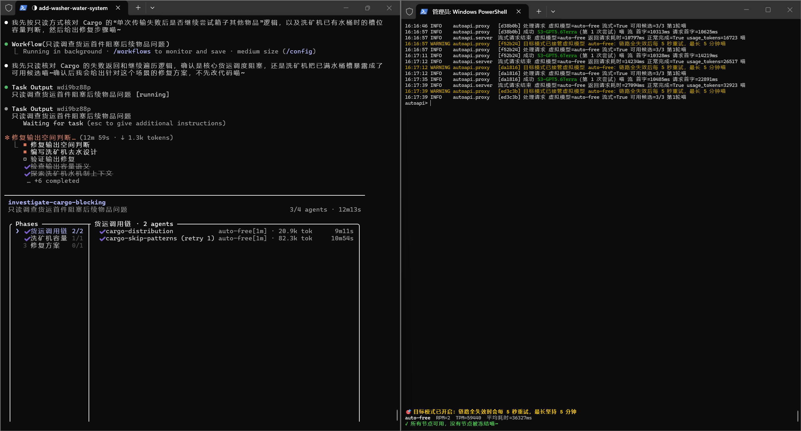

# autoapi

[English](README_EN.md) | [中文](README.md)

A transparent failover proxy for LLM APIs. Send requests to autoapi and it forwards them through an ordered chain of upstream candidates. When an upstream returns an error, a fake success (`200` with an `error` body), an empty stream, or a stalled stream, autoapi silently retries with the next candidate. Clients do not need to know that a failure occurred.

For clients, autoapi behaves like a regular OpenAI-compatible endpoint: point `base_url` to autoapi, set `model` to a virtual model name, and let the proxy handle the rest.

## Example



## What It Does

- **Protocol passthrough**: Request paths, query strings, headers, and bodies are forwarded unchanged. Only `base_url`, `api_key`, and the top-level `model` field are replaced. OpenAI `/v1/chat/completions` and Anthropic `/v1/messages` both work without protocol detection.
- **Silent failover**: Candidates are switched before any response bytes reach the client. Streaming requests are probed first and released only after enough content confirms that the stream is healthy.
- **Fake-success detection**: Upstreams that return HTTP 200 while placing an error in the response body, or create an SSE stream that emits nothing, are treated as failures.

## Core Concepts

### Virtual Models and Candidate Chains

Clients use a **virtual model** name such as `auto-strong`. Each virtual model maps to an ordered **candidate chain** of real upstreams:

```text
Virtual model: auto-strong
  1. Direct API   https://api.openai.com      gpt-4o
  2. Relay A      https://relay-a.example.com  gpt-4o
  3. Claude       https://api.anthropic.com    claude-sonnet-4-20250514
```

Every request starts at the first candidate, skips candidates currently frozen, and uses the first available one. The first candidate is always preferred; fallback happens only when it fails.

### Rule Engine

After an attempt fails, rules are evaluated from top to bottom. The first matching rule determines the action:

| Action | Meaning |
| --- | --- |
| `retry` | Retry the same candidate with exponential backoff. Switch candidates after retries are exhausted. |
| `next` | Immediately abandon the candidate and move to the next one. |
| `freeze` | Freeze the candidate globally for a period, then move to the next one. |
| `passthrough` | Return the upstream response to the client unchanged. |

If no rule matches, the conservative default action is `next`.

### Global Freezes and Automatic Hedging

Freezes are keyed by `(base_url, api_key, model)` and shared globally. Every virtual model referencing a frozen candidate skips it until the freeze expires. A successful request immediately unfreezes the candidate.

Automatic hedging protects against candidates that keep failing with varied errors. After `auto_hedge_threshold` consecutive failures, a candidate is automatically frozen for `auto_hedge_minutes`. One success resets the consecutive-failure count.

### No Global Fallback Chain

Candidate chains belong to individual virtual models. If one virtual model has no available candidates, autoapi returns **502** and includes each candidate's failure reason in the `attempts` field. It never borrows candidates from another virtual model, avoiding unexpected changes in cost, capability, or data routing.

## Installation and Startup

Requires Python 3.10 or newer.

```bash
pip install -r requirements.txt
cp config.example config.yaml
# Edit config.yaml and replace placeholder API keys with real keys.
python main.py
```

Point the client's `base_url` to `http://127.0.0.1:8787` and set `model` to a configured virtual model name.

### Windows EXE Package

GitHub Actions builds a Windows EXE on pushes to `master`, manual runs, and version tags matching `v*`. Standard build ZIP files are available as Actions artifacts; tagged builds are also attached to GitHub Releases.

The package contains only `autoapi.exe` and the public `config.example` template. It never includes `config.yaml` or real API keys. After extracting the package, create your private config with PowerShell:

```powershell
Copy-Item config.example config.yaml
.\autoapi.exe --no-repl -c config.yaml
```

Keep `config.yaml` private. Use `-c` or `--config` to point to a config file elsewhere.

## Key Configuration

The complete commented template is available in [`config.example`](config.example). A minimal setup looks like this:

```yaml
virtual_models:
  auto-strong:
    - name: Direct API
      base_url: https://api.openai.com
      api_key: sk-REPLACE-ME-1
      model: gpt-4o
      auth_style: bearer
```

Required candidate fields are `base_url`, `api_key`, and `model`. `auth_style` supports `bearer` and `x-api-key`.

Important server settings:

| Setting | Default | Meaning |
| --- | ---: | --- |
| `host` | `127.0.0.1` | Bind address; keep loopback unless an authenticated reverse proxy protects the service. |
| `port` | `8787` | Listening port. Requires restart after changing. |
| `stall_timeout` | `60` | Maximum silent period from the upstream, in seconds. |
| `stream_timeout` | `300` | Streaming probe budget before the response is released, in seconds. |
| `nonstream_timeout` | `600` | Non-streaming response budget, in seconds. |
| `connect_timeout` | `15` | Upstream connection timeout, in seconds. |
| `auto_hedge_threshold` | `5` | Consecutive failures before automatic freezing; `0` disables it. |
| `auto_hedge_minutes` | `10` | Automatic freeze duration, in minutes. |
| `ignored_error_endpoints` | `POST /v1/messages/count_tokens` | Exact `method + path` endpoint list. Only `POST`, `PUT`, `PATCH`, `GET`, and `DELETE` are routable, and paths cannot contain `?` or `#`. Matching endpoints still follow candidate rules, but skip automatic hedging, target-mode retries, and candidate warnings; exhausted chains log one info entry and still return `502`. When omitted, the default entry is used; `[]` disables all defaults; any non-empty list replaces the defaults, so include the default entry explicitly when it should remain ignored. |

For the complete REPL command reference, advanced timeout behavior, rule syntax, hot reload details, and target mode, see the [Chinese full documentation](README.md).

## HTTP Endpoints

| Path | Description |
| --- | --- |
| `GET /healthz` | Health check with virtual model count, frozen candidate count, request totals, and exhausted-chain totals. |
| `GET /v1/models` | Lists virtual models in OpenAI format. |
| Any other path | Forwarded transparently to the upstream. |

## Security Notes

> **This proxy does not authenticate clients.** Anyone who can reach the port can consume your upstream quota and use your keys through the proxy.

Keep `host` at `127.0.0.1`. Binding to `0.0.0.0` or another non-loopback address exposes upstream quota and keys unless an authenticated firewall or reverse proxy protects it.

`config.yaml` contains real upstream API keys and is ignored by `.gitignore`. Never commit it. Share `config.example` instead; it contains placeholders.

## Testing

```bash
pytest
python smoke_test.py
```

`pytest` runs unit tests for configuration parsing, rule matching, freeze logic, and stream probing. `smoke_test.py` starts real HTTP services and validates failover with real sockets and an `httpx` client.

## License

[Apache License 2.0](LICENSE)

## Star History

<a href="https://www.star-history.com/?repos=happy66dev%2FAutoAPI&type=date&legend=top-left">
 <picture>
   <source media="(prefers-color-scheme: dark)" srcset="https://api.star-history.com/chart?repos=happy66dev/AutoAPI&type=date&theme=dark&legend=top-left&sealed_token=gaO5fgqPoRn51RcqFvGkYCHyixpyO9yPD65650froUViP3AMMC2DQChcSmhwpkaEPOWWdVMt2HRzVlzokORF6iUWFI_1ALW8_uMgCy-Zo377m251MOytOND_k9E0_Z_WUPsEtqeuGnQxLdoRPt5Ozq3Ad4NuSOGGgpPTEGEGI4IF8l5lTgkrgRLbRRXr" />
   <source media="(prefers-color-scheme: light)" srcset="https://api.star-history.com/chart?repos=happy66dev/AutoAPI&type=date&legend=top-left&sealed_token=gaO5fgqPoRn51RcqFvGkYCHyixpyO9yPD65650froUViP3AMMC2DQChcSmhwpkaEPOWWdVMt2HRzVlzokORF6iUWFI_1ALW8_uMgCy-Zo377m251MOytOND_k9E0_Z_WUPsEtqeuGnQxLdoRPt5Ozq3Ad4NuSOGGgpPTEGEGI4IF8l5lTgkrgRLbRRXr" />
   
 </picture>
</a>
